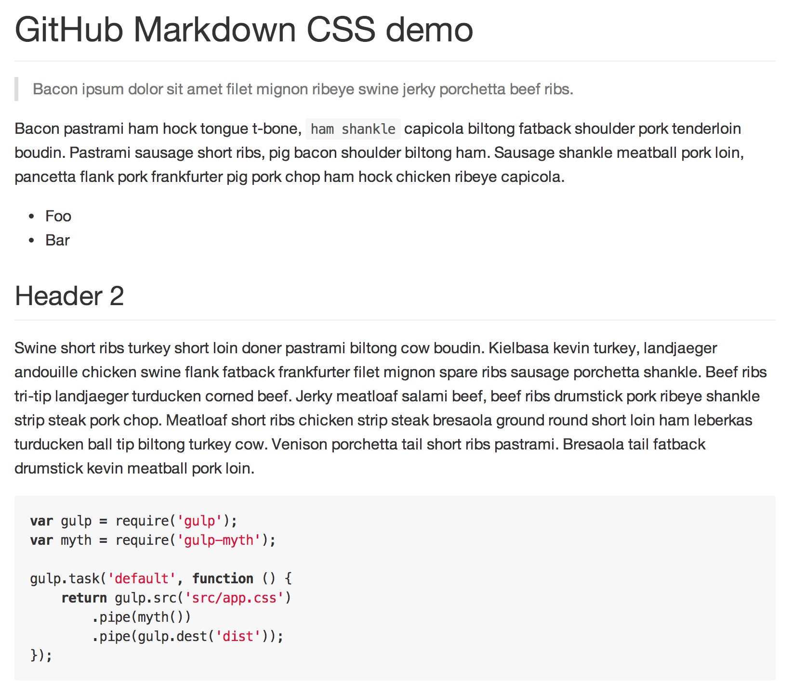

# github-markdown-css [](https://travis-ci.org/sindresorhus/github-markdown-css)

> The minimal amount of CSS to replicate the GitHub Markdown style

[](http://sindresorhus.com/github-markdown-css)

## [Demo](http://sindresorhus.com/github-markdown-css)


## How

First a [rendered Markdown](fixture.md) with all possible syntax is fetched from GitHub. Then the GitHub.com CSS is fetched and both are run through [UnCSS](https://github.com/giakki/uncss), which extracts only the used styles, and then through a custom cleanup.


## Install

Download [manually](https://raw.githubusercontent.com/sindresorhus/github-markdown-css/gh-pages/github-markdown.css) or with a package-manager.

```sh
$ npm install --save github-markdown-css
```

```sh
$ bower install --save github-markdown-css
```

```sh
$ component install sindresorhus/github-markdown-css
```


## Usage

Import the `github-markdown.css` file and add a `markdown-body` class to the container of your rendered Markdown and set a width for it. GitHub uses `790px` width and `30px` padding.

```html
<link rel="stylesheet" href="github-markdown.css">
<style>
	.markdown-body {
		min-width: 200px;
		max-width: 790px;
		margin: 0 auto;
		padding: 30px;
	}
</style>
<article class="markdown-body">
	<h1>Unicorns</h1>
	<p>All the things</p>
</div>
```


## Programmatic usage

I will try to keep it up to date, but you're free to fetch the CSS yourself either through the API or CLI.

```js
var githubMarkdownCss = require('github-markdown-css');

githubMarkdownCss(function (err, css) {
	if (err) {
		throw err;
	}

	console.log(css);
	//=> article { display: block; } ...
});
```


## CLI

```sh
$ npm install --global github-markdown-css
```

```sh
$ github-markdown-css --help

Usage
  $ github-markdown-css > <filename>
```


## License

MIT © [Sindre Sorhus](http://sindresorhus.com)
